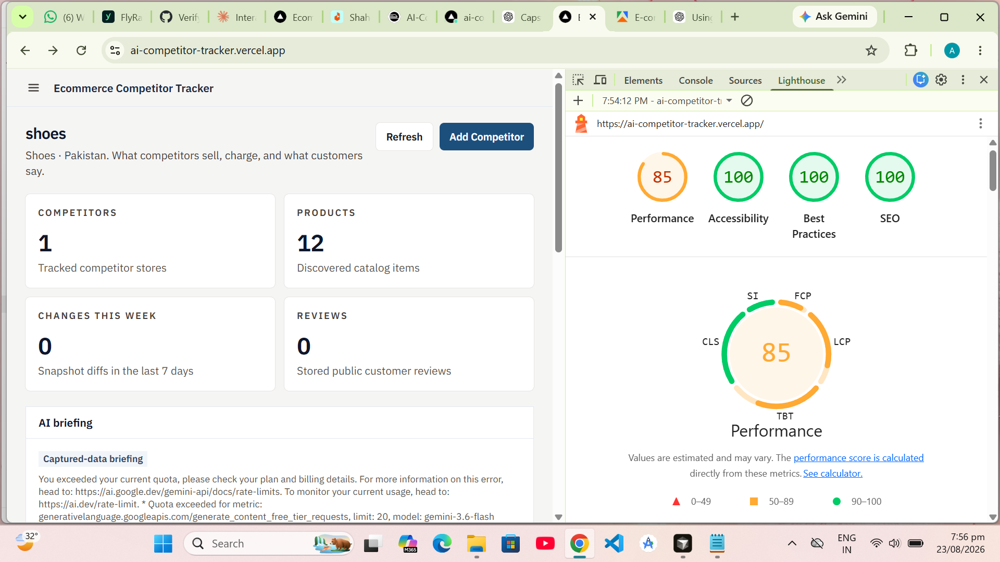
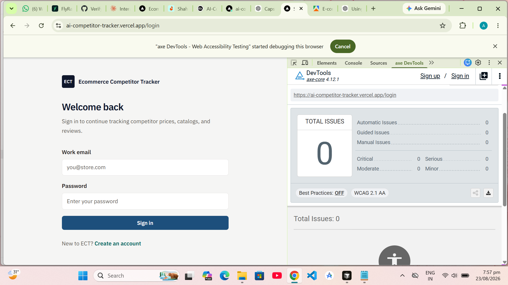
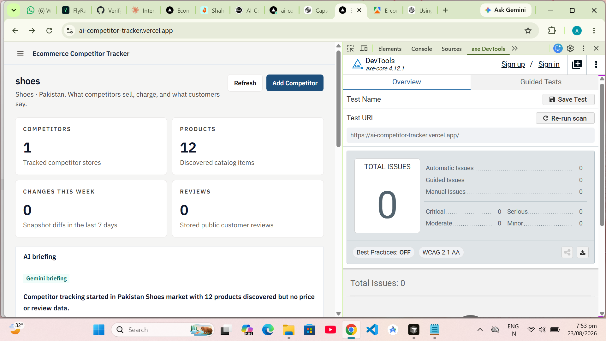

# Capstone packet

## 1. Project brief

Ecommerce Competitor Tracker helps small online sellers see what rivals charge, when catalogs change, and what customers complain about — using real store pages, not mock prices. It is for shop owners (especially Pakistan-market catalogs on Daraz and Shopify) who cannot check competitor sites every day. I built it because the hard problem is trustworthy capture; Claude/Gemini then turns those facts into a weekly briefing.

## 2. Live application

- App: https://ai-competitor-tracker.vercel.app
- API: https://ai-competitor-tracker-production.up.railway.app

Create an account, finish the 3-step onboarding, capture a competitor, then read **AI briefing** on Research. Open **AI Analyst** to ask follow-up questions; Gemini streams from the same captured facts.

## 3. Repository

https://github.com/Alishba-Nazem/AI-Competitor-Tracker

Setup is in the root [README](../README.md).

## 4. Testing

```bash
cd backend && npm test
cd frontend && npm test
```

| Suite | Result (25 Aug 2026) |
| --- | --- |
| Backend Jest | 29 suites, **137 passed** |
| Frontend Vitest | 11 files, **33 passed** |

Backend covers scrape helpers, onboarding isolation, briefing parse/fallback, review sentiment counting, and scheduler failure handling. Frontend covers `FindingList`, `AuthScreen`, `LoginForm`, `Field` labels, dashboard loading/error, review sentiment charts, `BriefingPanel`, streaming chat empty/stop/thinking states, and captured-fact prompt packing.

## 4b. Reporting visuals

The Research dashboard and every competitor workspace chart their stored review ratings instead of listing raw numbers: a like/mixed/dislike donut, a 1–5★ spread, ranked praise and complaint bars, and a captured price range with its median marker. Charts are hand-written SVG and CSS with no charting dependency, so the performance budget above still holds, and every plotted value is also rendered as text for screen readers. Reviews without a stored rating are reported separately and are never counted as a like or a dislike.

## 5. Performance and accessibility

**Fixes shipped:** skip-to-main-content, labeled mobile nav dialog, WCAG 2.1 AA contrast (including remapped `slate-400`/`slate-500`), login JS split for Lighthouse, and dashboard stats loaded only after sign-in.

**Production evidence (mobile / WCAG 2.1 AA, 23 Aug 2026)**

| Check | Result |
| --- | --- |
| Lighthouse Performance | **85** (pass bar 85) |
| Lighthouse Accessibility | **100** |
| Lighthouse Best Practices | **100** |
| Lighthouse SEO | **100** |
| axe login | **0** issues (Critical/Serious/Moderate/Minor all 0) |
| axe Research dashboard | **0** issues |







**Remaining (not a WCAG fail):** if Gemini’s free-tier quota is exhausted, Research shows a **captured-data briefing** from stored prices/reviews instead of a raw API error. Set `GEMINI_API_KEY` on Railway with remaining quota, or wait for the daily reset, for a live Gemini/Claude JSON briefing.

## 6. Deployment

Filled checklist and rollback: [DEPLOYMENT.md](../DEPLOYMENT.md).

## 7. Reflection

[docs/REFLECTION.md](./REFLECTION.md)
