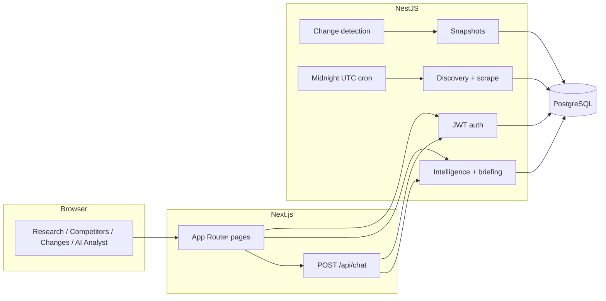
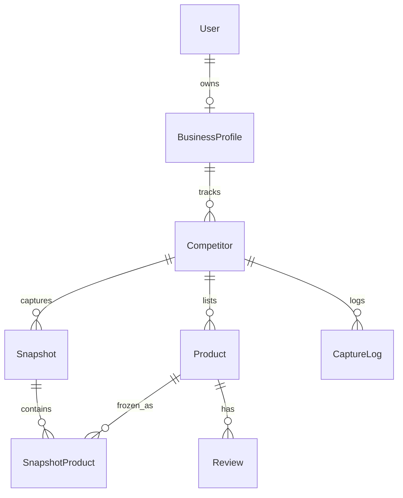
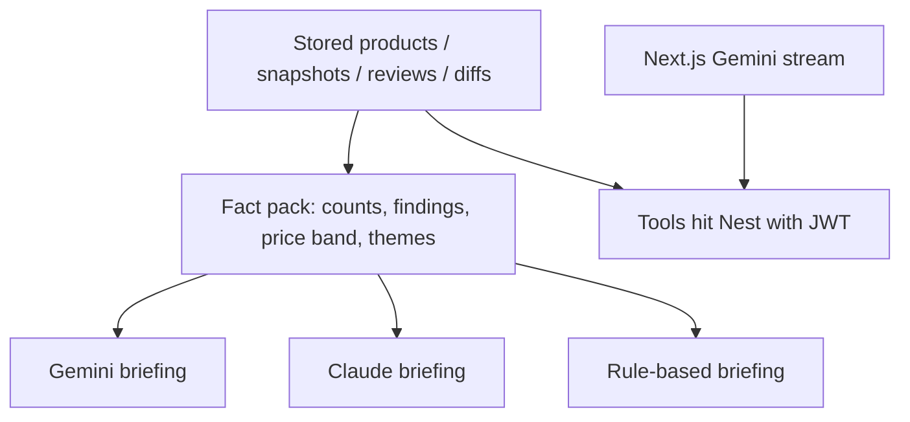

# Architecture

## High-level architecture

The system is a Next.js seller UI and a NestJS tracker API sharing one PostgreSQL database. Scraping and change detection live on the API. There are two AI entry points: a **briefing** generated on Nest from a fact pack, and a **streaming chat** hosted on Next.js that may call Nest with the seller’s JWT.

## Frontend

- **App:** Next.js 16 App Router in `frontend/`. Dev server: `next dev -p 3001`.
- **Auth UI:** `/login`, `/signup`. Token key `ect_auth_token` in `localStorage`. `AuthGate` blocks the workspace until a session exists. `OnboardingGate` sends new accounts to `/onboarding`.
- **Seller routes:** `/` Research, `/competitors`, `/competitors/[id]`, `/products`, `/changes`, `/reviews`, `/snapshots`, `/settings`, `/ai-assistant`.
- **Course-only route:** `/motion-demo` (no auth).
- **Primary nav:** Research, Competitors, Changes, AI Analyst, plus Settings.
- **Chat:** `frontend/app/api/chat` uses the Vercel AI SDK `streamText` and Gemini. Server tools: `getCompetitors`, `getDashboardSummary`, `queryCompetitorData`. They call the Nest API; they do not scrape.
- **3D:** `frontend/components/product-3d/` is dynamically imported only after **View in 3D**. WebGL probe + error boundary + scraped `imageUrl` fallback.

## Backend

NestJS 11 in `backend/src`. HTTP controllers (JWT unless noted):

| Prefix | Role |
| --- | --- |
| `/` | Health / root listen for Railway |
| `/auth` | Signup, login, `me` |
| `/onboarding` | Profile + first competitors + discovery |
| `/competitors` | CRUD / list for the signed-in profile |
| `/products` | Discovered catalog rows |
| `/scraper`, `/scrape-progress` | Manual discovery / capture |
| `/snapshots`, `/snapshot-products` | Point-in-time catalog copies |
| `/changes` | Diffs and history for owned competitors/products |
| `/reviews` | Stored public reviews |
| `/dashboard` | Summary counts |
| `/intelligence` | Dashboard pack, market, competitor intel, briefing |
| `/scheduler` | Trigger / inspect tracking runs |

`JwtAuthGuard` plus `WorkspaceService` 404s if the row is not on the current user’s profile.

## Database

Prisma 7, PostgreSQL, schema `backend/prisma/schema.prisma`. CLI URL comes from `DIRECT_DATABASE_URL` or a direct `DATABASE_URL` (`prisma.config.ts` rejects `prisma://` Accelerate URLs).

Isolation: `User.userId` → `BusinessProfile` → `Competitor`. Competitors created without a profile are not a supported multi-tenant path.

## Scraping / data collection

1. **Platform detect** (`backend/src/scraper/platform.ts`) — Daraz hostnames, Shopify signals, otherwise unknown.
2. **Discovery** — find product URLs from the store/seller page the seller typed. The UI does not ask for product URLs or prices at add-competitor time.
3. **Price scrape** — Cheerio and, where needed, Playwright. Methods stored on the product: `shopify`, `daraz`, `jsonld`, `unsupported`.
4. **Reviews** — public pages only. Keyword themes if no LLM is configured.
5. **Capture log** — `success` / `partial` / `failed`, `triggeredBy` `cron` or `manual`.

Cron: `@Cron(EVERY_DAY_AT_MIDNIGHT)` UTC in `CompetitorTrackingService`. Active competitors with `DAILY` or due `WEEKLY` are recaptured. Overlapping runs are skipped.

## Change detection

Implemented in `backend/src/changes/changes.service.ts` (`detectChanges`). It maps latest vs previous `SnapshotProduct` rows by `productId`:

- Missing in previous → new product
- Price delta → `PRICE_INCREASE` or `PRICE_DECREASE` (amount + percent)
- Known availability flip → availability change
- Missing in latest → removed product

The model is **not** asked “what changed in the database?” It only sees findings already computed.

## AI layer

**Briefing** (`GET /intelligence/briefing`): `factsFromDashboard` + `BRIEFING_SYSTEM_PROMPT` in `backend/src/intelligence/briefing.ts`. Provider order in `claude.client.ts`: Gemini if `GEMINI_API_KEY` is set, else Claude if `ANTHROPIC_API_KEY` is set, else `source: 'fallback'`. The prompt forbids inventing prices, products, or counts.

**Chat** (`POST /api/chat`): `GOOGLE_GENERATIVE_AI_API_KEY` on the Next host only. Default model `gemini-3.6-flash`. If the key is missing, the route returns a configuration error; there is no rule-based chat. Non-production `?testError=` sabotage exists for lifecycle testing and is disabled when `NODE_ENV === 'production'`.

## Data flow

1. Signup → JWT → onboarding writes `BusinessProfile` + `Competitor` rows → discovery writes `Product`s.
2. Capture writes `Snapshot` + `SnapshotProduct` + `CaptureLog`, updates `Product.currentPrice`.
3. A later capture is diffed; Changes and Research **What changed** read those diffs.
4. Reviews attach to products; Research charts use stored ratings (unrated reviews are not counted as like/dislike).
5. Intelligence builds the dashboard JSON; briefing optionally rewrites it.
6. AI Analyst tools re-read competitors, products, dashboard, and change endpoints.

## Important design decisions

### Change detection before AI

Change detection is handled in Nest against two snapshots **before** AI analysis. Gemini and Claude receive a structured fact pack (and chat tools return typed diffs or an explicit `stable` / `no_products` status). The model is not responsible for walking the database or inventing a “price drop” that no snapshot pair supports.

This matches the product constraint that a pretty briefing with a fake price is worse than a short fallback list of captured facts.

### Other decisions visible in the repo

- **Per-user workspaces** (`BusinessProfile.userId`) so a second signup cannot see another seller’s catalog.
- **Two Gemini keys** — Railway briefing vs Vercel chat — so the Next server never needs the Nest briefing secret, and `GOOGLE_GENERATIVE_AI_API_KEY` is never `NEXT_PUBLIC_`.
- **CORS allow-list** (`FRONTEND_URL`) instead of `*`.
- **Direct Postgres URL for Prisma CLI** so Railway/Accelerate `prisma://` URLs cannot silently break `db push`.
- **Lazy 3D** so Three.js is not on the critical path of Research or even an idle Products table.
